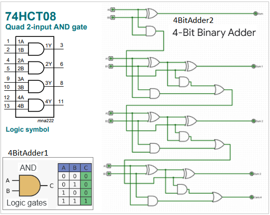
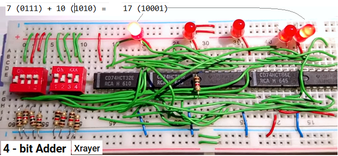
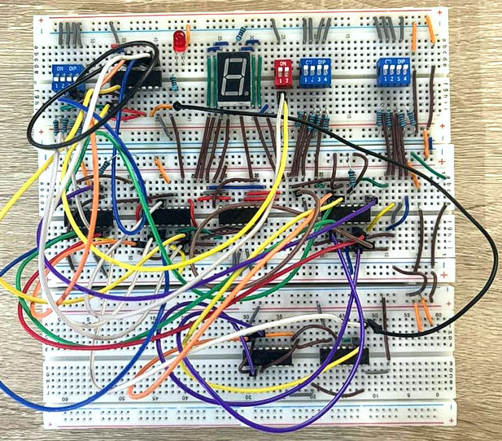

# Non-programmable digital circuits

To appreciate the advantages of programmable circuits / systems, you need to go back and see
what problems occur with earlier non-programmable circuits.

## Logical gates
As transistors developed, so-called logical gates were built on their connections.

For example, an AND gate is a simple circuit with two inputs and one output. High voltages (1 high approx. 5V) or low voltages (0 low approx. 0V - 1V) are applied to inputs A and B and voltages appear at output C: (1 high) or (0 low) according to the 4BitAdder1 table.
(1 high) will only occur in an AND gate if (1 high) are also present on A and B at the same time.
In other cases, C will be (0 low).

There are also similar gates with different functionality (other state tables), gates: OR, XOR, NOT, etc.
By physically connecting (with wires) different gates, simple digital circuits are obtained.

Fig.A1 Adder 4-bit schema

## Construction of a 4-bit adder
For example, connecting AND, OR, XOR logic gates as in Fig. 4BitAdder2 creates a simple addition calculator: by feeding two 4-bit numbers to inputs A0-A3 and to inputs B0-B3, you get their sum on five outputs C0-C4 (because there may be an overflow on 4).

Fig.A2 shows the physically made circuit - the role of 4-bit inputs A and B is played by red switches, output C is five LEDs. By switching the switches, we get the appropriate LED lighting. The figure shows the addition made: 7 (0111) + 10 (1010) = 17 (10001). In the adder, the gate pins are connected with green wires and such connections create the adder.

Fig.A2 Adder 4-bit - physical circuit

-----------
## No possibility of changes in static systems
But in this system, you can't perform e.g. subtraction and other operations. You would have to manually change the wire connections. You can connect increasingly complex systems, but then the number of wires increases and the chaos grows. The system below Fig.A3 has a large tangle of cables and still does not allow for easy changes.

Fig.A3 Advanced digital static layout.

## Processors - electronic systems with variable functions / capabilities.

The lack of flexibility in static systems gave rise to the search for flexible systems, in which the functions of the system could be changed not mechanically but electrically / electronically.

In this way, a processor was constructed - a flexible system that can be 'told' what functions to perform.

This 'telling' the system what to do was called 'programming'. Since then, electronic systems called processors have developed greatly, but each type of them has this sought-after advantage: you do not have to change anything mechanically in it - just upload the appropriate sequence of numbers to it, and it will treat the uploaded numbers as commands and execute them - e.g. by performing addition, subtraction or multiplication or even more complicated operations.

## This chapter is part of the main project

This chapter is part of the <a href="https://github.com/janluksoft/NET_MainComparison">NET Main Comparison project</a>:  
"Comparison of software development methods from low-level methods to .NET".

The next chapter is:
<a href="https://github.com/janluksoft/InMemory_Assembler">Direct CPU programming – assembler</a>

